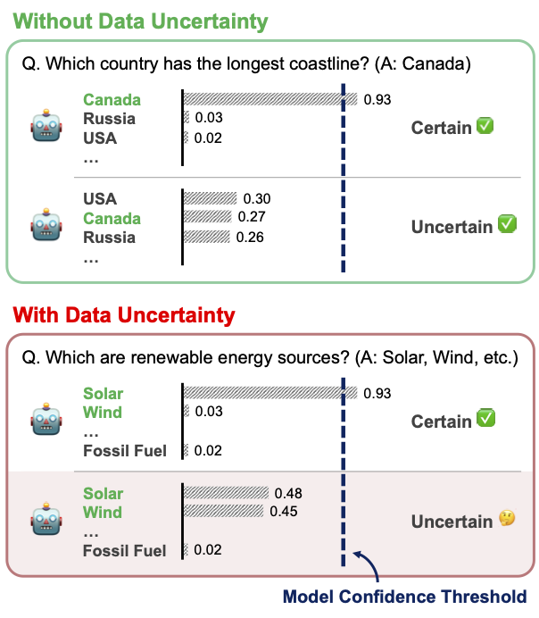
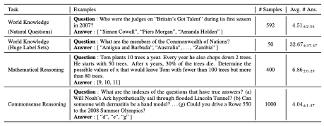

# MAQA: Evaluating Uncertainty Quantification in LLMs Regarding Data Uncertainty

Official repository for our our Findings of NAACL 2025: [MAQA: Evaluating Uncertainty Quantification in LLMs Regarding Data Uncertainty](https://www.arxiv.org/pdf/2408.06816) by

Yongjin Yang, Haneul Yoo, Hwaran Lee.

# Overview

> Although large language models (LLMs) are capable of performing various tasks, they still suffer from producing plausible but incorrect responses.
> To improve the reliability of LLMs, recent research has focused on uncertainty quantification to predict whether a response is correct or not.
> However, most uncertainty quantification methods have been evaluated on questions requiring a single clear answer, ignoring the existence of data uncertainty that arises from irreducible randomness.
> Instead, these methods only consider model uncertainty, which arises from a lack of knowledge.
> In this paper, we investigate previous uncertainty quantification methods under the presence of data uncertainty.
> Our contributions are two-fold: 1) proposing a new Multi-Answer Question Answering dataset, MAQA, consisting of world knowledge, mathematical reasoning, and commonsense reasoning tasks to evaluate uncertainty quantification regarding data uncertainty, and 2) assessing the uncertainty of diverse white- and black-box LLMs using 5 different metrics.
> Our findings show that entropy and consistency-based methods estimate the model uncertainty well even under data uncertainty, while other methods for white- and black-box LLMs struggle.
> Additionally, logit-based methods suffer from overconfidence in reasoning tasks compared to simple knowledge queries.
> We believe our observations will pave the way for future work on uncertainty quantification in realistic setting.

<p align="center">
  
</p>

# MAQA Dataset

All our MAQA datasets are placed in the datasets folder, with each file starting with the "MAQA\_" prefix. There are three different tasks: retrieving world knowledge, mathematical reasoning, and commonsense reasoning. The world knowledge portion of MAQA is divided into two sets: one based on the [Natural Questions Dataset](https://storage.googleapis.com/pub-tools-public-publication-data/pdf/b8c26e4347adc3453c15d96a09e6f7f102293f71.pdf), denoted by the suffix NQ, and the other created by the authors using Wikipedia as a source, where each question has a large number of answers, marked with the suffix HLS. Note that single-answer question-answering datasets, used for comparison with our MAQA, are also in the folder with "single" as a prefix. The overview of our dataset, along with examples, is listed below:

<p align="center">
  
</p>

# Evaluating QA on Benchmarks

Here are some detailed explanations of major files or folders.

1. generate_text.py : This file uses the Huggingface interface to generate text based on the given instructions (questions)
2. take_qa_test.py : This file is the main file that tests various uncertainty quantification methods on specific benchmarks. It uses `generate_text.py` to generate texts and evaluate their correctness and uncertainty.
3. uncertainty/ : This folder contains functions to calculate uncertainty quantification methods for both white-box and black-box LLMs.
4. evaluation.py : This file contains an Evaluator class that includes multiple metrics of correctness, including exact match, ROUGE score, and more.
5. result.ipynb : This notebook is an example of code to evaluate the performance of uncertainty quantification methods using AUROC and AUPRC. You can freely add other metrics for evaluation.
6. scripts/ : This folder contains bash scripts to evaluate the models on QA benchmarks, including both single-answer datasets and our MAQA. To use greedy decoding to estimate uncertainty using logit values or verbalized confidence, you can use the `run_qa_tests.sh` script. If you want to use the response-consistency-based method, you can use `run_qa_tests_sample.sh` to enable sampling. Additionally, there is a `request_api.sh` script to get generated text from OpenAI chat models.

Below are some important command line arguments to run the script. These arguments are placed in the `generate_text.py` file.

```
options:
  -m MODEL, --model MODEL
                        Which LLM to use. Check this file for currently supported options and/or add
                        your own.
  -n MAX_NEW_TOKENS, --max_new_tokens MAX_NEW_TOKENS
                        Number of new tokens to generate on top of the prompt
  -k NUM_TOP_TOKENS, --num_top_tokens NUM_TOP_TOKENS
                        For each token, print out the top candidates considered by the model and
                        their probabilities
  -c, --completion_mode
                        Use traditional auto-complete mode, rather than user-assistant chat
  -s, --do_sample       Should we sample from the probability distribution, or greedily pick the most
                        likely token?
  -r NUM_RESPONSES, --num_responses NUM_RESPONSES
                        Number of responses to generate per prompt. This argument is ignored for
                        greedy decoding, since that only generates one answer.
  -d DATASET, --dataset DATASET
                        The name of the QA dataset.
  -q QUESTION_RANGE, --question_range QUESTION_RANGE
                        When running a Q&A test, what range of questions should we test? Format is
                        "-q startq-endq", 0 indexed. For example, "-q 0-100". You can set the value to "0-0 to test the model on the full dataset.
  -b BATCH_SIZE, --batch_size BATCH_SIZE
                        Maximum number of prompts to batch together. Only used for experiments
  -g PROMPT_PHRASING, --prompt_phrasing PROMPT_PHRASING
                        When running a Q&A test, which of the two prompt phrasings should we use? 0
                        or 1
  -u UE_MODE, --ue_mode UE_MODE
                        When running a Q&A test, which line of uncertainty quantification methods do you want to use: white-box based or black-box based?
  -e EVAL_METHODS, --eval_methods EVAL_METHODS
                        When running a Q&A test, what metrics should be used to calculate the correctness of the model responses?
  -o OVERWRITE, --overwrite OVERWRITE
                        Option to choose whether you want to overwrite the existing result files.
```

# Running Evaluations

There are two scripts to run the experiments.

1. run_qa_tests.sh, which calls take_qa_test.py (which in turn calls generate_text.py) with greedy decoding. Usage:

```
./run_qa_tests.sh <comma-separated model names> <comma-separated dataset names> <comma-separated question ranges> prompt_phrasing overwrite_option <comma-separated eval methods>
```

For example,

```
./scripts/run_qa_tests.sh Mistral,Qwen-7b,Llama-3-8b,Zephyr,Gemma-7b MAQA_world_knowledge_nq 0-0 1 True rouge,exact_match
```

2. run_qa_tests_sample.sh, which calls take_qa_test.py (which in turn calls generate_text.py) with sampling. Usage:

```
./run_qa_tests_sample.sh <comma-separated model names> <comma-separated dataset names> <comma-separated question ranges> prompt_phrasing overwrite_option <comma-separated eval methods>
```

For example,

```
./scripts/run_qa_tests_sample.sh Mistral,Qwen-7b,Llama-3-8b,Zephyr,Gemma-7b MAQA_world_knowledge_nq 0-0 1 True rouge,exact_match
```

# Acknowledgements

Our code is based on the repository of paper [&#34;Softmax Probabilities (Mostly) Predict Large Language Model Correctness on Multiple-Choice Q&amp;A&#34;](https://arxiv.org/pdf/2402.13213.pdf). We thank the authors for releasing their code. If you use our model and code, please consider citing these works as well.

Additionally, some of our datasets are built on [Natural Questions](https://aclanthology.org/Q19-1026.pdf), [GSM8k](https://arxiv.org/abs/2110.14168), [MMLU](https://arxiv.org/abs/2009.03300), and [StrategyQA](https://arxiv.org/abs/2101.02235). Therefore, please make sure to credit and cite these works when using our dataset.
